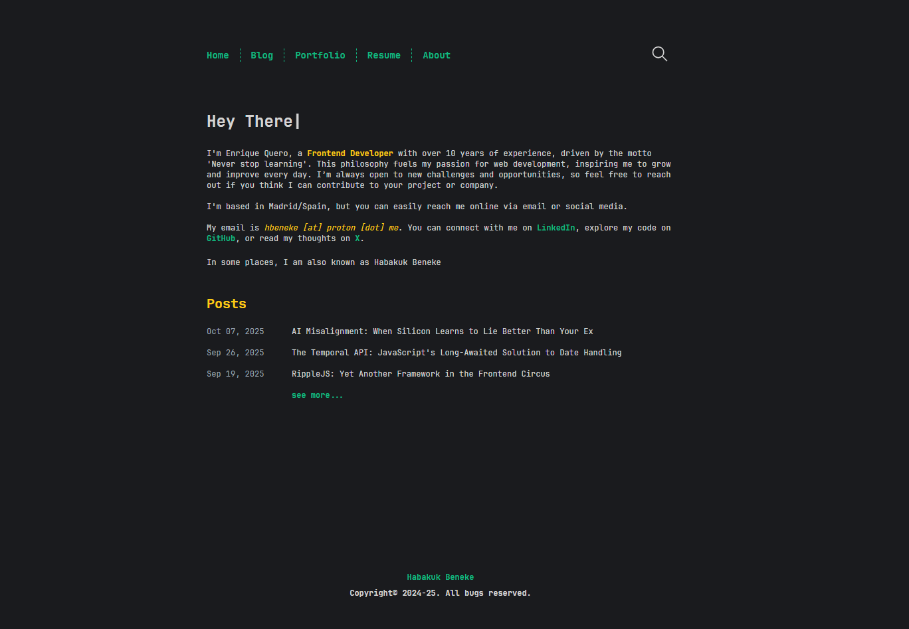

# Personal Site

[](https://www.gnu.org/licenses/gpl-3.0)
[](https://equero.dev)
[](https://github.com/hbeneke/personal-site)

A modern, fast, and SEO-optimized personal portfolio website built with Astro, featuring a blog, portfolio showcase, and interactive resume.



**[Live Demo](https://equero.dev)**

## About This Project

This project serves as my personal digital space where I showcase my professional journey, share technical insights through blog posts, and highlight my development projects. Built with modern web technologies, it emphasizes performance, accessibility, and developer experience.

**Inspiration:** This project is highly inspired by [astro-theme-cactus](https://github.com/chrismwilliams/astro-theme-cactus) by [Chris Williams](https://github.com/chrismwilliams).

## Tech Stack

This project leverages modern web technologies:

- **[Astro](https://astro.build/)** - Static Site Generator with optimal performance
- **[TypeScript](https://www.typescriptlang.org/)** - Type-safe development
- **[Tailwind CSS](https://tailwindcss.com/)** - Utility-first CSS framework
- **[Vitest](https://vitest.dev/)** - Fast unit testing framework
- **[Biome](https://biomejs.dev/)** - Fast linter and formatter
- **[Pagefind](https://pagefind.app/)** - Static search library
- **[Vercel](https://vercel.com/)** - Deployment and hosting platform
- **[Shiki](https://shiki.matsu.io/)** - Syntax highlighting for code blocks

## Getting Started

### Prerequisites

- **Node.js** 18.x or higher
- **npm** or **pnpm** package manager

### Installation & Development

1. Clone the repository:

   ```bash
   git clone https://github.com/hbeneke/personal-site.git
   cd personal-site
   ```

1. Install dependencies:

   ```bash
   npm install
   # or
   pnpm install
   ```

   This will automatically install Git hooks for version management. See [Git Hooks](#git-hooks) section for details.

1. Start the development server:

   ```bash
   npm run dev
   # or
   pnpm dev
   ```

   The site will be available at `http://localhost:4321`

## Testing

Run unit tests:

```bash
npm run test
# or
pnpm test
```

Generate coverage report:

```bash
npm run coverage
# or
pnpm coverage
```

## Code Quality

This project uses Biome for linting and formatting:

```bash
npm run lint
# or
pnpm lint
```

## Git Hooks

The project includes automated Git hooks for version management:

### Available Hooks

- **pre-commit**: Automatically increments the patch version (e.g., 1.0.0 → 1.0.1) when committing non-markdown files
- **post-merge**: Automatically increments the minor version (e.g., 1.0.5 → 1.1.0) when merging `develop` into `master`

### Installation

Hooks are automatically installed when you run `npm install`. To manually install or reinstall:

```bash
npm run hooks:install
```

To uninstall hooks:

```bash
npm run hooks:uninstall
```

For more details, see [`.githooks/README.md`](./.githooks/README.md).

## Project Structure

```text
/
├── public/              # Static assets (fonts, icons, images)
├── src/
│   ├── components/      # Astro components
│   ├── content/         # Content collections (posts, portfolio, etc.)
│   ├── layouts/         # Page layouts
│   ├── pages/           # Route pages
│   ├── scripts/         # Client-side scripts
│   ├── styles/          # Global styles and CSS
│   ├── types/           # TypeScript type definitions
│   └── utils/           # Utility functions
├── scripts/             # Build and automation scripts (see scripts/README.md)
├── tests/               # Unit tests
└── astro.config.mjs     # Astro configuration
```

For detailed information about build and automation scripts, see [`scripts/README.md`](./scripts/README.md).

## Contributing

Contributions are welcome! This project is open source under the GPL-3.0 license, which means you can use, modify, and distribute the code as long as you maintain the same license.

### How to Contribute

1. **Fork the repository**
2. **Create a feature branch** (`git checkout -b feature/amazing-feature`)
3. **Make your changes**
4. **Run tests and linting**:

   ```bash
   npm run test
   npm run lint
   ```

5. **Commit your changes** (`git commit -m 'Add some amazing feature'`)
6. **Push to the branch** (`git push origin feature/amazing-feature`)
7. **Open a Pull Request**

### Contribution Guidelines

- Follow the existing code style (enforced by Biome)
- Use [Conventional Commits](https://www.conventionalcommits.org/) for commit messages (e.g., `feat:`, `fix:`, `docs:`, `chore:`)
- Add tests for new features
- Update documentation as needed
- For large changes, consider opening an issue first to discuss

## License

This project is licensed under the **GNU General Public License v3.0** - see the [LICENSE](./LICENSE) file for details.

This means you are free to:

- ✅ Use this code for personal or commercial projects
- ✅ Modify and adapt the code
- ✅ Distribute your modifications

Under the conditions that:

- You must disclose the source code
- You must include the same GPL-3.0 license
- You must state significant changes made to the code

## Author

### Enrique Quero (Habakuk Beneke)

- Website: [equero.dev](https://equero.dev)
- GitHub: [@hbeneke](https://github.com/hbeneke)
- LinkedIn: [equerodev](https://www.linkedin.com/in/equerodev/)
- X (Twitter): [@habakukbeneke](https://x.com/habakukbeneke)

## Acknowledgments

- [Chris Williams](https://github.com/chrismwilliams) for the [astro-theme-cactus](https://github.com/chrismwilliams/astro-theme-cactus) theme that heavily inspired this project
- The Astro team for creating an amazing framework
- All contributors and supporters of this project

---

If you find this project useful, consider giving it a star on GitHub!
