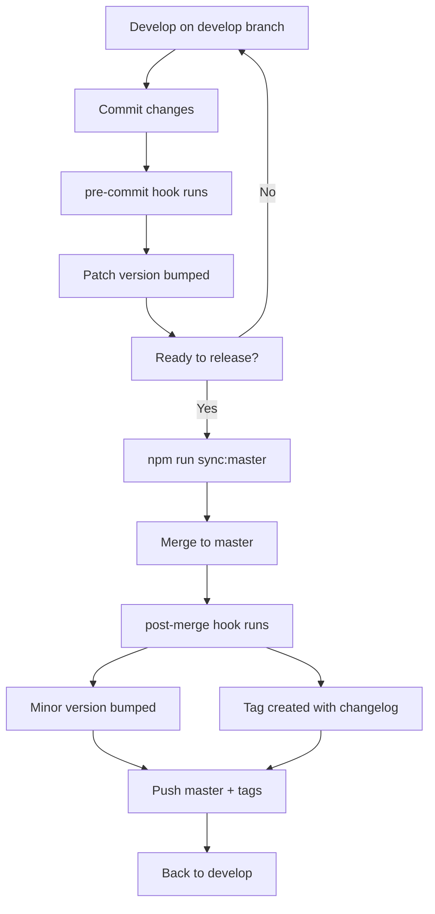

# Scripts

This directory contains utility scripts for automating various tasks in the project lifecycle, including build processes, Git workflow management, and development tooling.

## Available Scripts

### `build-search.mjs`

Generates the search index for the static site using Pagefind.

**Purpose:**

- Scans HTML files in the build output
- Creates a searchable index for fast client-side search
- Automatically detects Vercel or dist build directories

**Usage:**

```bash
npm run build:search
```

**When it runs:**

- Automatically after the build process
- Can be run manually for debugging

**Output:**

- Creates search index in the build directory
- Enables instant search functionality on the site

---

### `install-hooks.mjs`

Installs Git hooks for automated version management.

**Purpose:**

- Copies Git hooks from `.githooks/` to `.git/hooks/`
- Sets proper execution permissions
- Enables automated versioning workflow

**Hooks installed:**

- `pre-commit`: Auto-increment patch version on commits
- `post-merge`: Auto-increment minor version on develop→master merges

**Usage:**

```bash
npm run hooks:install
```

**When it runs:**

- Automatically during `npm install` (postinstall)
- Can be run manually if hooks need reinstalling

**See also:**

- [`.githooks/README.md`](../.githooks/README.md) for detailed hook documentation

---

### `uninstall-hooks.mjs`

Removes installed Git hooks.

**Purpose:**

- Safely removes Git hooks from `.git/hooks/`
- Useful for debugging or disabling automated versioning

**Usage:**

```bash
npm run hooks:uninstall
```

**When to use:**

- When you need to disable automatic versioning
- For troubleshooting Git hook issues
- Before manual Git operations that conflict with hooks

---

### `sync-master.mjs`

Automated workflow for syncing develop branch to master with version bumping.

**Purpose:**

- Automates the complete release workflow
- Ensures consistency in version management
- Reduces manual steps and potential errors

**What it does:**

1. Verifies you're on the `develop` branch
2. Checks for uncommitted changes
3. Pushes `develop` to remote
4. Switches to `master` and merges `develop`
5. Triggers post-merge hook (auto version bump + tag with changelog)
6. Pushes `master`, `develop`, and new tags to remote
7. Returns to `develop` branch

**Usage:**

```bash
npm run sync:master
```

**Requirements:**

- Must be on `develop` branch
- No uncommitted changes
- Git hooks must be installed

**Output example:**

```text
Syncing develop to master...

On develop branch
No uncommitted changes
Pushing develop to origin...
Switching to master...
Merging develop into master...
Version bumped from 1.4.0 to 1.5.0
Tag v1.5.0 created with changelog:
- feat: add new portfolio section (a1b2c3d)
- fix: correct typo in about page (e4f5g6h)
Pushing master to origin...
Pushing tags to origin...
Switching back to develop...

Sync complete!
```

---

## Workflow Integration

These scripts work together to provide a seamless development and release workflow:



## Development

All scripts are written in ES modules (`.mjs`) and use Node.js built-in modules for maximum compatibility.

**Testing scripts:**

```bash
# Test individual scripts
node scripts/build-search.mjs
node scripts/install-hooks.mjs
node scripts/sync-master.mjs
```

**Debugging:**

- Scripts output colored emoji indicators for status
- Check script exit codes for automation integration
- Review console output for detailed progress

## Contributing

When adding new scripts:

1. Use `.mjs` extension for ES modules
2. Add proper error handling
3. Include descriptive console output with emojis
4. Document in this README
5. Add corresponding npm script in `package.json`

---

**See also:**

- [Project README](../README.md) - Main project documentation
- [Git Hooks README](../.githooks/README.md) - Detailed hook documentation
